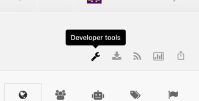

# Ink

A collection of commands to automatize tedious tasks in the form of a command line interface.

## Installation

* Clone the project
* Install python if not already present
    * Help: I recommend using the [official python installer](https://www.python.org/downloads/) over brew
* Create an alias in your .zshrc pointing to [main.py](main.py)

```
alias ink="~/Documents/.../ink_utils/main.py"
```

* Go to the cloned project's root directory and install the project's python dependencies

```
python3 -m pip install -r requirements.txt
```

* Copy the [settings.yml.example](settings.yml.example) file and remove the `.example` part
* Fill in the copied file with data corresponding to your projects

## settings.yml

The structure of all available parameters can be checked inside [settings.yml.example](settings.yml.example).

The top-level entries represent individual Android modules. This is how you can define and support any project you want in Ink.
You are free to name a project however you want, this is how you will refere to it when using Ink. There is also a special
reserved project name `global` which is used for global settings rather than a specific project.

Values are only read when you run a command that requires them. Otherwise, they may be left empty or filled with placeholder data.
If a required value is missing when a command is executed, the command will be aborted and a warning will be displayed indicating
which parameters are missing.

### Setup for loco import

The setup for `ink loco` to work requires you to define an api key for Loco and a module path where strings will be copied to.

The Loco API key only requires read access. To obtain your key, open the developer tools from the top-right menu in Loco.



## Commands and documentation

The available commands can be listed with the help command:

```
ink --help
```

Each command includes additional documentation for reference, for example:

```
ink loco --help
```

## Project selection

Some commands will work in regard to a specific Android module. To use Ink, you need to select a current project.

Projects can be listed with `ink project` and a specific project, let's say "mail", can be selected using `ink project mail`. The
name of the projects match the names you have defined inside your `settings.yml` local file.

## Update

Ink will automatically fetch your Git project the first time you run a command each day and will notify you if an Ink update is
available.

To easily update, you can run the following command which will automatically pull the main branch for you.

```
ink update
```